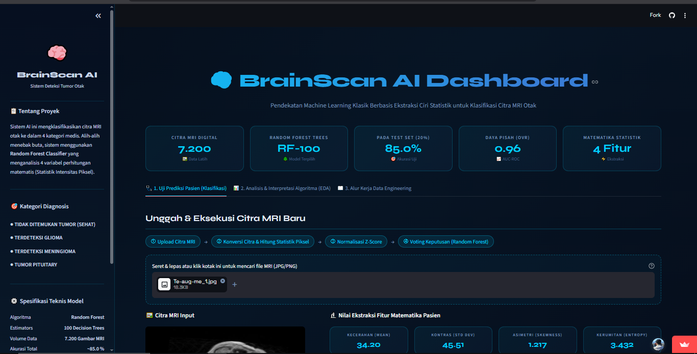
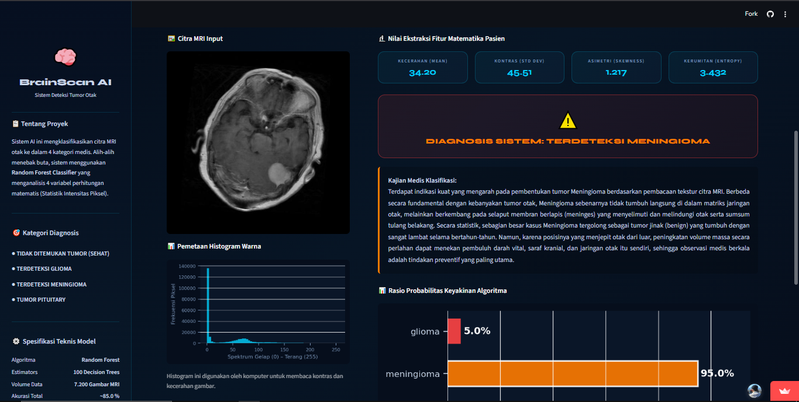
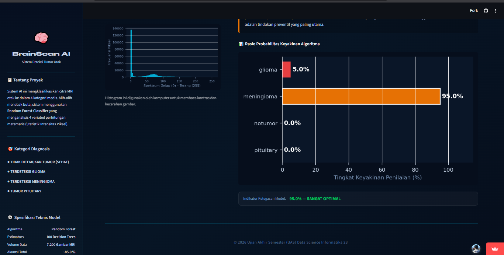

# 🧠 BrainScan AI: Sistem Deteksi & Klasifikasi Tumor Otak

[](https://uas-sistem-klasifikasi-tumor-otak.streamlit.app/)
[](https://colab.research.google.com/github/MiewRBN/UAS-Data-Science-Sistem-Deteksi-Klasifikasi-Tumor-Otak/blob/main/UAS_DATA_SCIENCE%20(5).ipynb)

**BrainScan AI** adalah platform analisis citra medis berbasis kecerdasan buatan (*Artificial Intelligence*) yang dirancang untuk membantu identifikasi jenis tumor otak melalui pemindaian MRI. Sistem ini mengklasifikasikan citra ke dalam empat kategori utama: **Glioma, Meningioma, Pituitary,** atau **No Tumor**.

Proyek ini merupakan implementasi nyata dari alur kerja *Data Science*, mulai dari pemrosesan awal citra, ekstraksi fitur statistik, hingga deployment model menggunakan Streamlit.

---

# 🚀 Live Demo & Video Tutorial

- 🌐 **Coba Aplikasi Langsung:**  
  https://uas-sistem-klasifikasi-tumor-otak.streamlit.app/

- 📹 **Video Demonstrasi:**  
  Ganti link berikut dengan video YouTube Anda sendiri.

[](MASUKKAN_LINK_YOUTUBE_ANDA_DI_SINI)

---

# 🖥️ Antarmuka Web (User Interface)

Aplikasi dirancang dengan antarmuka bertema medis yang gelap (*dark mode*), responsif, dan mudah digunakan.

## 1. Tampilan Utama dan Area Unggah



## 2. Proses Analisis Metrik Statistik



## 3. Hasil Diagnosis AI



---

# 🗂️ Dataset

Dataset MRI otak diperoleh dari Kaggle:

🔗 https://www.kaggle.com/datasets/masoudnickparvar/brain-tumor-mri-dataset

---

# 🔬 Metodologi: Ekstraksi Fitur Statistik

Sistem menggunakan pendekatan **Ekstraksi Fitur Statistik Orde Pertama** dari citra MRI untuk menghasilkan representasi numerik dari gambar.

Fitur yang digunakan:

- Mean Intensity
- Standard Deviation
- Skewness
- Entropy

Proses ekstraksi dilakukan terhadap **7.200 citra MRI**.

## 📄 Log Proses Ekstraksi

```text
Mengekstrak fitur statistik dari 7200 citra MRI...
Proses Ekstraksi: 100%|██████████| 7200/7200 [1:16:41<00:00, 1.56it/s]
Ekstraksi Selesai! Data siap dianalisis.
```

## 📋 Cuplikan Data Hasil Ekstraksi

Berikut adalah contoh 5 data pertama hasil ekstraksi fitur statistik dari citra MRI:

| Target_Label | Mean_Intensity | Std_Deviation | Skewness | Entropy |
|---------------|----------------|----------------|-----------|----------|
| pituitary | 40.995617 | 38.880632 | 1.050988 | 4.269688 |
| pituitary | 53.817429 | 45.676158 | 0.679193 | 4.507432 |
| pituitary | 39.800488 | 44.045064 | 0.785165 | 3.906781 |
| pituitary | 38.694794 | 38.392227 | 0.900112 | 4.043531 |
| pituitary | 55.282166 | 40.974956 | 1.043873 | 4.817195 |

Data hasil ekstraksi tersebut kemudian digunakan sebagai input model *Machine Learning* untuk proses klasifikasi jenis tumor otak.

---

# 📊 Proporsi Data

Dataset dibagi menggunakan metode **Stratified Split** agar distribusi kelas tetap seimbang.

| Kategori | Jumlah Data | Persentase |
|-----------|-------------|-------------|
| Data Latih (Train) | 5760 | 80% |
| Data Uji (Test) | 1440 | 20% |

---

# 🏆 Evaluasi Model

Dua model yang dibandingkan:

- Random Forest
- Support Vector Machine (SVM)

## 1. Random Forest (Model Terbaik)

| Kelas Tumor | Precision | Recall | F1-Score | Support |
|--------------|------------|---------|-----------|----------|
| glioma | 0.80 | 0.76 | 0.78 | 360 |
| meningioma | 0.79 | 0.77 | 0.78 | 360 |
| notumor | 0.96 | 0.97 | 0.96 | 360 |
| pituitary | 0.83 | 0.87 | 0.85 | 360 |
| **Akurasi Global** |  |  | **0.84** | 1440 |
| **AUC-ROC** |  |  | **0.9616** |  |

## 2. Support Vector Machine (SVM)

| Kelas Tumor | Precision | Recall | F1-Score | Support |
|--------------|------------|---------|-----------|----------|
| glioma | 0.68 | 0.68 | 0.68 | 360 |
| meningioma | 0.60 | 0.58 | 0.59 | 360 |
| notumor | 0.80 | 0.84 | 0.82 | 360 |
| pituitary | 0.76 | 0.75 | 0.76 | 360 |
| **Akurasi Global** |  |  | **0.71** | 1440 |
| **AUC-ROC** |  |  | **0.8923** |  |

---

# 📈 Visualisasi Data

## 1. Korelasi Antar Fitur (Heatmap)

## 2. Distribusi Data (Boxplot)

## 3. Feature Importance

Berdasarkan analisis model, fitur **Entropy** dan **Mean Intensity** menjadi parameter paling berpengaruh terhadap hasil klasifikasi.

## 4. Confusion Matrix

Perbandingan hasil prediksi antara:

- Random Forest
- Support Vector Machine (SVM)

---

# ⚙️ Instalasi dan Menjalankan Aplikasi

## Prasyarat

- Python 3.10+
- pip

## 1. Clone Repository

```bash
git clone https://github.com/miewrbn/uas-data-science-sistem-deteksi-klasifikasi-tumor-otak.git
cd uas-data-science-sistem-deteksi-klasifikasi-tumor-otak
```

## 2. Membuat Virtual Environment

```bash
python -m venv venv
```

### Linux / MacOS

```bash
source venv/bin/activate
```

### Windows

```bash
venv\Scripts\activate
```

## 3. Install Dependencies

```bash
pip install -r requirements.txt
```

## 4. Jalankan Streamlit

```bash
streamlit run app.py
```

---

# 📁 Struktur Proyek

```text
├── assets/
├── app.py
├── model_tumor_rf.pkl
├── scaler_tumor.pkl
├── requirements.txt
├── UAS_DATA_SCIENCE (4).ipynb
└── UAS_DATA_SCIENCE (5).ipynb
```

---

# ⚠️ Disclaimer

Aplikasi ini dibuat hanya untuk tujuan edukasi dan penelitian akademik.

Hasil prediksi AI tidak dapat digunakan sebagai pengganti diagnosis medis profesional. Tetap konsultasikan kepada dokter spesialis untuk hasil medis yang akurat.

---

# 👨‍💻 Pengembang

Dikembangkan untuk proyek **Ujian Akhir Semester (UAS)** Mata Kuliah Data Science.

- Universitas Siliwangi
- Program Studi Informatika
- BrainScan AI © 2026
